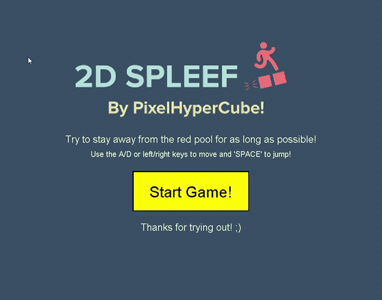

# 2d-Spleef
### A 2D Spleef game inspired by spleef games in Minecraft!

I thought of making this game as I was thinking about how to make a game that is similar to Minecraft spleef, but in 2D!

One of my first few games that I made using Java!

-----

### How to play
##### Aim of game - Avoid the red pool below for as long as possible!
1. Click on the 'Start Game!' button to begin the game
2. Try to run and jump as fast quickly to avoid breaking the blocks beneath you!
3. Standing on the same block for too long will cause it to break and you'll descend to the level below you.
4. Game Over - when you drop into the red pool
5. Click on the 'Back to Menu' button to return to menu / 'Restart Game!' button to restart the game

### Controls
- W/D or ← / → keys to move left/right respectively
- 'SPACE' key to jump

----- 
## How to download and play:
### Unfortunately, double clicking on the jar file will not open the program 😢
(Will try to fix that if its possible)
### However, I've found an alternative way of running the file!

1. Download the jar file by going to: https://github.com/pixelhypercube/2d-Spleef/releases/download/1.0/2dSpleef.jar
2. Then, open the Command Prompt (Windows) / Terminal (Mac).
3. Go to where the directory of the file is stored by using the command below:
##### Windows
```
cd <file-location-folder> (e.g. C:\Users\<your-username>\Downloads )

OR 

cd Downloads (After just opening Command Prompt)
```
##### Mac
```
cd <file-location-folder> (e.g. /Users/<your-username>/Downloads )

OR 

cd Downloads (After just opening Terminal)
```
4. Finally, run the command below to open the window
```
java -jar 2dSpleef.jar
```
5. If all goes well, you can see the game being shown!
(May have to wait a moment as it may take a while to start up)

-----

### Demo of gameplay:
P.S. the graphics may not look the best on the program itself (e.g. blurry images)


