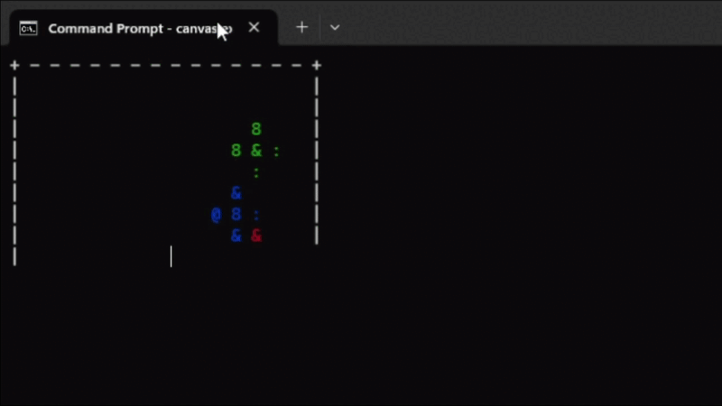

# CPP-Physics

A quick mini physics simulator I made using C++!

### List of Commands
| Command         | Parameters                    | Description                               |
|----------------|-------------------------------|-------------------------------------------|
| `/add`         | `<x> <y> <r> <vx> <vy> <color>`| Adds a ball into the simulation           |
| `/back`        | *(none)*                       | Returns to the simulation                 |
| `/setbordertype`| `<type>`                      | Changes the border type                   |
| `/setdimensions`| `<width> <height>`            | Changes the dimensions of the canvas      |
| `/help`        | *(none)*                       | Provides a full list of commands          |

