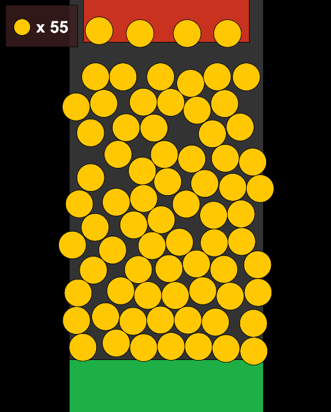

# Coin-Dozer-Replica
A web remake of [Coin Dozer](https://www.gamecircus.com/Games/coin-dozer/) that I used to play when I was a kid!
Made using matter.js and p5.js!

[Project Link](https://pixelhypercube.github.io/Side-Projects/Coin-Dozer-Replica)

## How to play:
<ol>
    <li>Drop coins onto the platform to push the coins into the collector!</li>
    <li>Be careful, coins will be lost when they fall on the sides!</li>
    <li>How long will you last with a 100 coins in your pocket?</li>
</ol>
