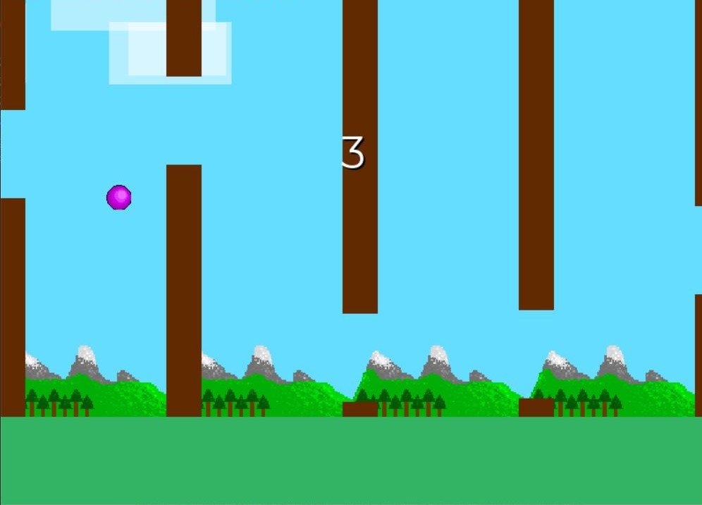
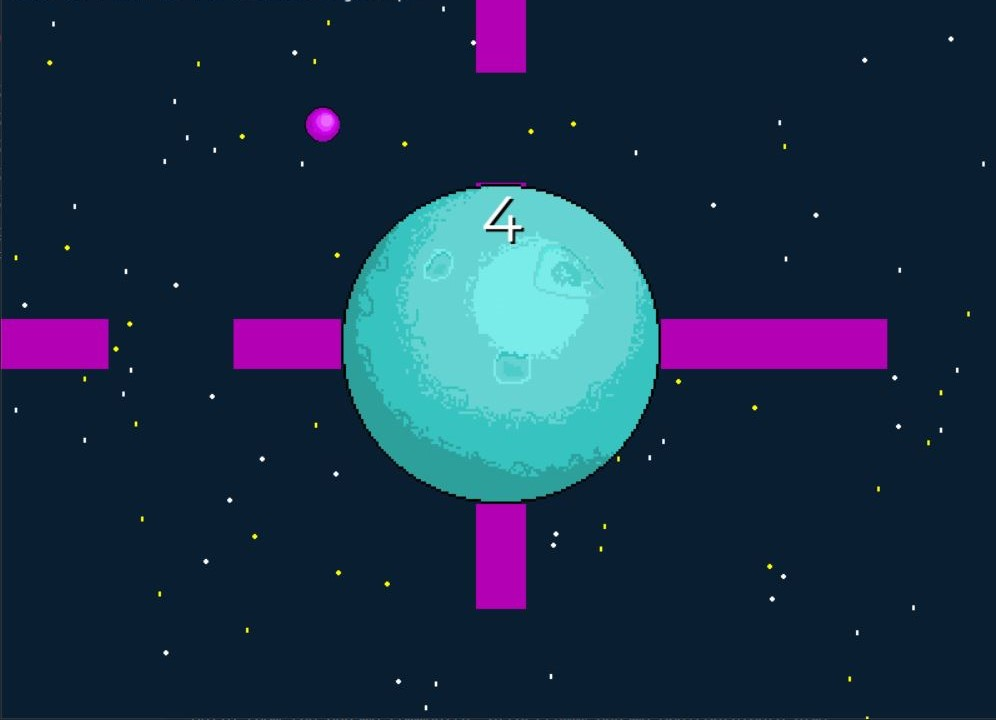
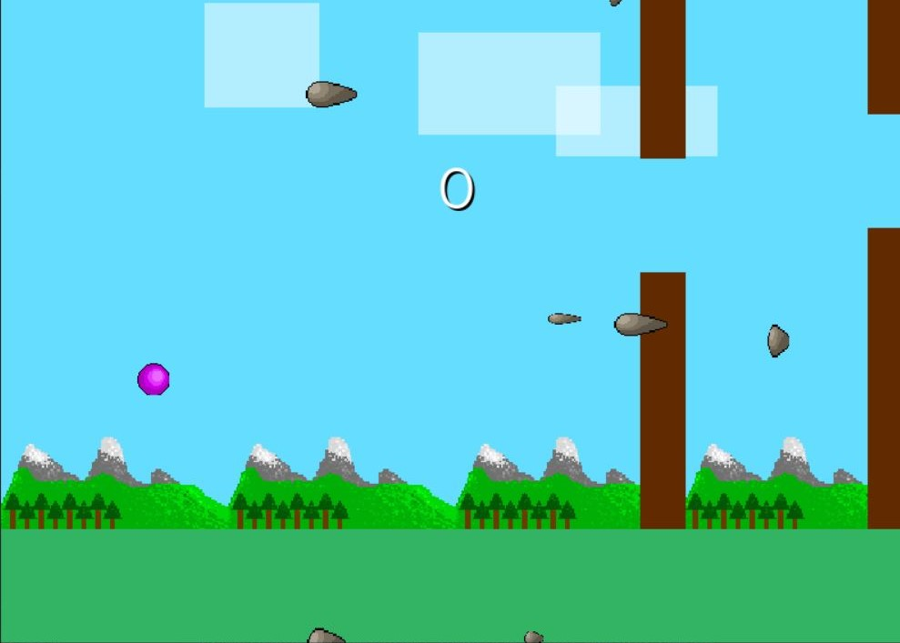
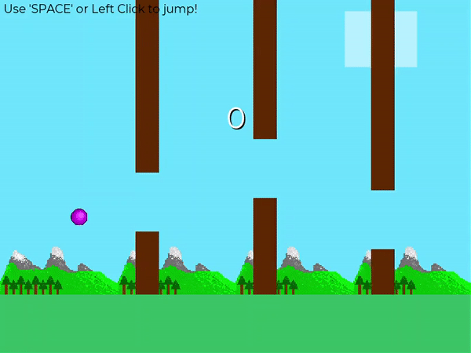

# PHC-Minigolf
### My second game (on github) using pygame!

Inspired by the original <i>Flappy Bird</i> game made by dotGEARS, I've decided to make a personal project of it but I wanted to add in more game modes to make it more exciting!

---

# Download:
#### Link : https://github.com/pixelhypercube/Mini-Projects/releases/download/FlappyPixelball-v1.0/flappyPixelball-v1.0.zip
### How to run the program:
1. Extract the zip file by double clicking on it
2. Double click on game.exe and start playing!!!

- Unfortunately, game.exe wouldn't work if it's in other directories :( (may try to fix in a next update)

(Sorry my drawings aren't that great as I'm trash at doing art stuff haha ;) )

## Normal Level (just like Flappy Bird)

## Planet Level (implements radial gravity) (beta)

## Projectile Level (adds a new challenge - projectiles)

## Game Demo (Normal Level)

---
## How to play:
#### Just like Flappy Bird, let the pixelball fly between the pipes to accumulate points! Be careful though, don't let the ball touch the pipe or the ground!

### Controls (in-game)
| Key  | Function |
| --- | --- |
| Left Click / Space | Jump |

---
