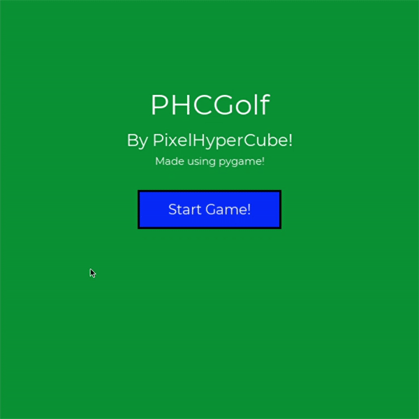

# PHC-Minigolf
A mini golf game made using pygame!

One of my first successful programs I've made using pygame! 😃

---
## Download:
#### Link : https://github.com/pixelhypercube/Mini-Projects/releases/download/PHCMinigolf-1.0beta/PHC-Minigolf-1.0beta.zip
### How to run the program:
1. Extract the zip file by double clicking on it
2. Double click on game.exe and start playing!!!

- Unfortunately, game.exe wouldn't work if it's in other directories :( (may try to fix in a next update)
- The buttons may not work 100% correctly - holding down the buttons for a while may do the trick (hopefully...) 🤞
---
## How to play:
#### Just like golf, get the ball into the hole with the least number of shots possible!

### Controls (in-game)
| Key  | Function |
| --- | --- |
| Left Click | Adjust strength (press), Hit ball (release) |
| Esc / P | Pause / Resume game |
---

## Game Demo

